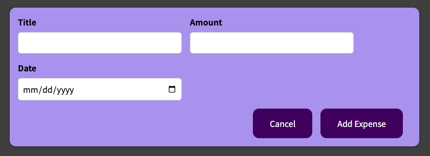

# Expense Tracker React App

The Expense Tracker is a React application that helps track users' monthly expenses with an easily accessible user interface. The application also features filters based on the expenses date and our dynamic chart that renders the spend of each month.
### User Interface

The user interface features new main components: add expense form, expense chart, and expense list. 

  

- <strong>Add Expense Form:</strong>
  The add expense form would appear when clicked on the "Add New Expense" button on the top of the user interface. The form requires three input: The title of the new expense, The amount of the new expense, and the date of the new expense.

  

    
  

- <strong>Expense Chart</strong>
  The expense chart is a bar chart that displays the curated spend of each month based on the year selected. This allow user to visualize and compare each month's spend.

- <strong>Expense List</strong>
  The expense list displays all the input expenses within the year selected.

